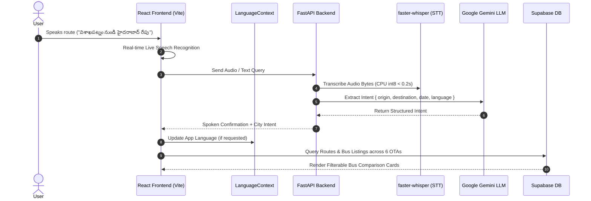

# 🚌 YatraSaathi (యాత్ৰా సాథి / यात्रा साथी)
> **India's First Multilingual AI Voice-Enabled Bus Aggregator & Fare Comparison Platform**

[](https://reactjs.org/)
[](https://vitejs.dev/)
[](https://www.typescriptlang.org/)
[](https://tailwindcss.com/)
[](https://fastapi.tiangolo.com/)
[](https://www.python.org/)
[](https://supabase.com/)
[](LICENSE)

---

## 🌟 Overview

**YatraSaathi** is a state-of-the-art AI-powered bus fare aggregator and multilingual voice assistant designed specifically for Indian bus travelers. It allows users to search, compare ticket prices, and view seat amenities across **6 leading Online Travel Agencies (OTAs)** in one unified search:

- 🔴 **redBus**
- 🔵 **MakeMyTrip**
- 🟢 **AbhiBus**
- 🟠 **TravelYaari**
- 🩵 **EaseMyTrip**
- 🟣 **Paytm Bus**

With **YatraSaathi**, users can speak naturally in any of **12+ Indian languages** (Telugu, Hindi, Tamil, Kannada, Malayalam, Marathi, Gujarati, Bengali, Punjabi, Odia, Urdu, English) using continuous voice recording. The entire application UI dynamically updates to the user's selected or spoken language in real-time.

---

## ✨ Key Features

- 🌐 **App-Wide Dynamic Multilingual Translations**: Full real-time translation across ALL pages (Home, Search Results, Bus Cards, Filter Panel, Header, Footer, and Payment Checkout) in 12+ Indian languages (*Telugu, Hindi, Tamil, Kannada, Malayalam, Marathi, Gujarati, Bengali, Punjabi, Odia, Urdu, English*).
- 💺 **Interactive Seat Selection & Payment Checkout**: Select lower/upper deck sleeper or seater berths, input passenger details, select payment options (UPI, GPay, PhonePe, Cards, Net Banking), and receive instant confirmed tickets with PNR and QR code vouchers.
- 🎙️ **Multilingual Continuous Voice Search**: Tap the mic and speak naturally in your native language (e.g., *"రేపు వైజాగ్ నుండి హైదరాబాద్ బస్సులు"* or *"buses from Bangalore to Chennai tomorrow"*).
- 🛑 **Hands-Free Voice Stop Command**: Microphone stays on continuously without interrupting your speech until you tap Stop or say a stop keyword (*"stop"*, *"ఆపు"*, *"रोको"*, *"நிறுத்து"*, *"ನಿಲ್ಲಿಸಿ"*, etc.).
- 🏙️ **22 Major Cities & Stations**: Full coverage for top Indian transit hubs including Visakhapatnam, Hyderabad, Vijayawada, Chennai, Bengaluru, Tirupati, Guntur, Rajahmundry, Kakinada, Nellore, Kurnool, Anantapur, Warangal, Karimnagar, Mumbai, Pune, Delhi, Kolkata, Kochi, Coimbatore, Madurai, and Mysuru.
- ⚡ **Zero-Latency Instant Speech Recognition**: Utilizes Web Speech API for real-time live transcription with high-speed fallback.
- 🚌 **12+ Bus Options Per Route Across 6 OTAs**: Compares bus ticket deals from 12 major operators (*APSRTC, TSRTC, VRL, Morning Star, Orange Tours, IntrCity SmartBus, Zingbus, Kaveri, SRS, GreenLine, Nuego Electric, Jabbar*) across redBus, MakeMyTrip, AbhiBus, TravelYaari, EaseMyTrip, and PaytmBus.
- 🤖 **Dual AI & Rule-Based Intent Extraction**: Integrates Google Gemini AI (`gemini-1.5-flash`) with a fast local regex fallback engine for zero-lag route resolution.
- 🔊 **Text-To-Speech (TTS) Guidance**: Spoken voice confirmations and step-by-step guidance in native regional languages powered by Edge-TTS / Web Speech API.
- 📊 **Comprehensive Filter & Sort**: Filter by Sleeper, Semi-Sleeper, Seater, AC/Non-AC, Volvo/BharatBenz, price range, and star rating.
- 🔒 **Secure Auth & Analytics**: User login, signup, and admin dashboards powered by Supabase PostgreSQL and Row Level Security (RLS).

---

## 🛠️ Technology Stack

### Frontend
- **Framework**: [React 18](https://reactjs.org/) + [TypeScript](https://www.typescriptlang.org/)
- **Build Tool**: [Vite 5](https://vitejs.dev/)
- **Styling**: [Tailwind CSS](https://tailwindcss.com/) with glassmorphism & dynamic gradients
- **Icons**: [Lucide React](https://lucide.dev/)
- **Routing**: [React Router v6](https://reactrouter.com/)

### Backend
- **Framework**: [FastAPI](https://fastapi.tiangolo.com/) (Python 3.10+)
- **Speech-to-Text (STT)**: `faster-whisper` (CPU int8 multi-threaded optimization) + Web Speech API
- **LLM / Intent Parser**: [Google Gemini AI API](https://aistudio.google.com/) (`gemini-1.5-flash`) + Local Regex Fallback Engine
- **Text-to-Speech (TTS)**: `edge-tts` (Microsoft Edge neural voices for Indian languages)
- **Audio Processing**: `imageio-ffmpeg`

### Database & Cloud
- **Database**: [Supabase PostgreSQL](https://supabase.com/) with RLS Policies
- **Authentication**: Supabase Auth

---

## 🏗️ Architecture & Flow



---

## 🚀 Getting Started

### Prerequisites
- **Node.js**: v18.0.0 or higher
- **Python**: v3.10 or higher
- **Git**

---

### 1. Clone the Repository

```bash
git clone https://github.com/jhansi-jjs/YatraSaathi.git
cd YatraSaathi
```

---

### 2. Frontend Setup

```bash
# Install dependencies
npm install

# Create environment configuration (.env)
cat <<EOT > .env
VITE_SUPABASE_URL=https://your-supabase-url.supabase.co
VITE_SUPABASE_ANON_KEY=your-supabase-anon-key
VITE_BACKEND_URL=http://localhost:8000
GEMINI_API_KEY=your-gemini-api-key
WHISPER_LOCAL_PATH=C:\path\to\whisper-model
WHISPER_DEVICE=cpu
EOT

# Start Vite dev server
npm run dev
```

The frontend will start at **`http://localhost:5174/`** (or `http://localhost:5173/`).

---

### 3. Backend Setup

```bash
cd backend

# Install Python dependencies
pip install -r requirements.txt

# Create backend environment configuration (.env)
cat <<EOT > .env
GEMINI_API_KEY=your-gemini-api-key
WHISPER_LOCAL_PATH=C:\path\to\whisper-model
WHISPER_DEVICE=cpu
EOT

# Start FastAPI server
python -m uvicorn main:app --reload --port 8000
```

The backend server will run at **`http://127.0.0.1:8000`**.

---

## 🌐 Supported Languages & Neural TTS Voices

| Language Code | Language Name | Native Script | TTS Neural Voice Engine |
| :---: | :---: | :---: | :---: |
| `te` | Telugu | తెలుగు | `te-IN-ShrutiNeural` |
| `hi` | Hindi | हिन्दी | `hi-IN-SwaraNeural` |
| `ta` | Tamil | தமிழ் | `ta-IN-PallaviNeural` |
| `kn` | Kannada | ಕನ್ನಡ | `kn-IN-SapnaNeural` |
| `ml` | Malayalam | മലയാളം | `ml-IN-SobhanaNeural` |
| `mr` | Marathi | मराठी | `mr-IN-AarohiNeural` |
| `gu` | Gujarati | ગુજરાતી | `gu-IN-DhwaniNeural` |
| `bn` | Bengali | বাংলা | `bn-IN-TanishaaNeural` |
| `ur` | Urdu | اردو | `ur-IN-GulNeural` |
| `pa` | Punjabi | ਪੰਜਾਬੀ | Browser Fallback |
| `or` | Odia | ଓଡ଼ିଆ | Browser Fallback |
| `en` | English | English | `en-IN-NeerjaNeural` |

---

## 📡 API Endpoints Reference

| Method | Endpoint | Description |
| :--- | :--- | :--- |
| `GET` | `/health` | Server health check endpoint |
| `GET` | `/languages` | Returns supported Indian languages & TTS availability |
| `POST` | `/voice-search` | Uploads recorded WebM audio for Whisper STT & intent resolution |
| `POST` | `/text-search` | Accepts text input for instant LLM/rule-based intent extraction |
| `POST` | `/tts` | Synthesizes spoken MP3 audio in target Indian language |

---

## 🏙️ Supported Cities & Stations (22 Hubs)

```
Visakhapatnam  •  Hyderabad     •  Vijayawada   •  Chennai
Bengaluru      •  Tirupati      •  Guntur       •  Rajahmundry
Kakinada       •  Nellore       •  Kurnool      •  Anantapur
Warangal       •  Karimnagar    •  Mumbai       •  Pune
Delhi          •  Kolkata       •  Kochi        •  Coimbatore
Madurai        •  Mysuru
```

---

## 📜 License

Distributed under the MIT License. See `LICENSE` for more details.

---

## Acknowledgments

- **Built with**: React, Vite, FastAPI, Google Gemini AI, faster-whisper, edge-tts, and Supabase.
